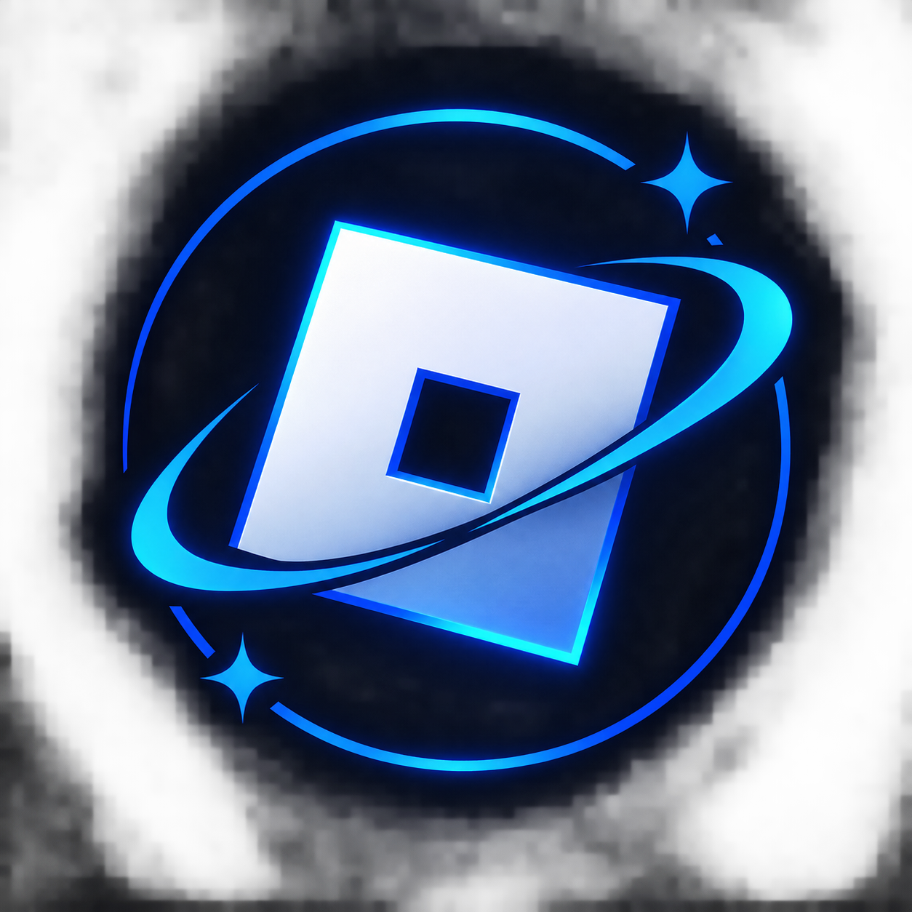

<div align="center">



# Vantage

**Interface, engineered.**

A Roblox interface library with one animation scheduler, seeded themes built
from real colour maths, frame-drawn icons, and a loading screen that tells the
truth about what it is doing.

`v1.0.0` · 30 modules · 44 glyphs · 10 themes · zero runtime dependencies

[Quick start](#quick-start) · [Install](#install) · [Tutorial](docs/TUTORIAL.md) ·
[Modules](#what-is-in-the-box) · [Theming](#theming) · [Loading screen](#the-loading-screen) ·
[Verification](#verification)

</div>

---

## Quick start

Paste this into an executor, or into a `ModuleScript` (see [Install](#install)):

```lua
local Vantage = loadstring(game:HttpGet(
    "https://raw.githubusercontent.com/Irakli17/Ui-Library-Test/main/Vantage.luau"
))()

-- Preload with the wave logo, bottom-right of the safe area.
Vantage.LoadingScreen.Run({
    Assets = { "rbxassetid://0" },
    Logo = { Image = "rbxassetid://0" },
    Title = "My Game",
}).wait()

-- Then the interface itself.
Vantage.Setup({ Theme = "obsidian" })

local window = Vantage.Window.new({ Name = "My Game", Subtitle = "Settings" })
local general = window:Tab({ Name = "General", Icon = "sliders" })
local appearance = general:Section({ Name = "Appearance", Description = "How the game looks." })

appearance:Toggle({ Name = "Reduce motion", Value = false, Callback = print })
appearance:Slider({ Name = "Interface scale", Min = 0.75, Max = 1.5, Value = 1, Callback = print })
appearance:Button({ Text = "Apply", Variant = "primary", Callback = function() end })
```

A five-minute, copy-paste walkthrough lives in
**[docs/TUTORIAL.md](docs/TUTORIAL.md)**.

---

## Install

### 1 · Loadstring (fastest)

The single-file build is designed for this: the bundle never dereferences the
`script` global — namespace aliases resolve through an internal registry — so
it runs identically as a `ModuleScript`, as a `loadstring` chunk, and inside a
plugin. This is asserted by the test suite rather than assumed (see
[Verification](#verification)).

```lua
-- annotated build, 434 KB
local Vantage = loadstring(game:HttpGet(
    "https://raw.githubusercontent.com/Irakli17/Ui-Library-Test/main/Vantage.luau"
))()

-- minified build, 334 KB, same code with comments and blank lines stripped
local Vantage = loadstring(game:HttpGet(
    "https://raw.githubusercontent.com/Irakli17/Ui-Library-Test/main/dist/Vantage.min.luau"
))()
```

`dist/Vantage.luau` is the canonical artifact; the copy at the repository root
exists so the URL stays short. Both are byte-identical.

If `raw.githubusercontent.com` throttles you, the same bytes are on jsDelivr,
which caches aggressively:

```lua
"https://cdn.jsdelivr.net/gh/Irakli17/Ui-Library-Test@main/Vantage.luau"
```

> GitHub has to serve the file publicly: the repository must be **public** and
> the branch in the URL (`main`) must exist. Files are served as `text/plain`,
> which `game:HttpGet` returns verbatim.

### 2 · Rojo

```bash
git clone https://github.com/Irakli17/Ui-Library-Test
cd Ui-Library-Test
rojo serve            # default.project.json maps src/ → ReplicatedStorage.Vantage
```

```lua
local Vantage = require(game.ReplicatedStorage.Vantage)
```

### 3 · Manual

1. Open [`dist/Vantage.luau`](dist/Vantage.luau) and copy it.
2. In Studio, insert a `ModuleScript` under `ReplicatedStorage`, name it
   `Vantage`.
3. Paste the file in, replacing everything.
4. `local Vantage = require(game.ReplicatedStorage.Vantage)`.

No uploads, no asset IDs, no account. Icons are drawn from frames, and the
library never requests anything from the network.

### 4 · In Studio with `loadstring`

Studio allows `loadstring` only when `ServerScriptService.LoadStringEnabled`
is on. Everywhere else (executors, plugins) it is available by default.

---

## Why it does not feel like other interface libraries

| | |
| --- | --- |
| **One scheduler** | Tweens, springs and tickers share a single `RunService` loop. A new tween on a property supersedes the one it replaces instead of racing it, so nothing jitters when two code paths animate the same thing. Springs sub-step at 1/240 s so they stay stable at 144 Hz. |
| **Themes derived, not hand-tuned** | A theme is a seed colour plus a mode. The tokens — surfaces, borders, text, states — are derived from it with real colour maths, and every theme is checked against WCAG contrast when it is registered. Live theme changes morph the tokens rather than cutting. |
| **Icons without images** | 44 glyphs (`check`, `gear`, `search`, `wave`, `progress-ring`, …) are drawn from vector points and frames at runtime, so there is no icon atlas to upload, no nine-slice to misalign, and no chance of a broken image in someone else's game. |
| **Feedback by default** | Every button answers a press: a ripple that originates under the pointer, a 96.5 % press scale, a colour ramp, and an optional cue. Toggles spring, sliders snap to ticks, segmented controls slide one indicator, dropdowns flip when they would leave the screen. |
| **A loading screen that measures** | Real `ContentProvider:PreloadAsync` progress, weighted phases, rotating tips, stall detection, minimum and maximum durations, and a Continue affordance with a visible countdown. |
| **Tests that run the shipped file** | The suite executes the exact bytes of `dist/Vantage.luau` through `loadstring` with the `script` global deleted, against a mock Roblox runtime. |

---

## What is in the box

### Core

| Module | What it is |
| --- | --- |
| `Vantage.Motion` | The scheduler. `tween`, `spring`, `scale`, `breathe`, `ticker`, property ownership, reduced-motion handling, `stats()` and `audit()`. |
| `Vantage.Theme` | Seeded theme derivation, live token morphing, `register`, `fromSeed`, `export`, `bind`. |
| `Vantage.Easing` | 30+ curves plus a real cubic-bezier solver, so CSS-style control points behave the way you expect. |
| `Vantage.Util` | Colour maths (mix, lighten, darken, contrast), fuzzy matching, formatting, viewport and safe-area helpers, `padNumber`. |
| `Vantage.Signal`, `Vantage.Maid` | Lightweight signals and deterministic teardown. Everything the library builds is owned by a Maid. |
| `Vantage.Glyph` | The frame-drawn icon set, plus `animateIn` and colour/transparency helpers. |
| `Vantage.Config` | Global defaults you can read, write and observe. |

### Structure

`Vantage.Window` (chrome, sidebar, status bar with live FPS/ping/memory,
drag, resize, maximise, UI scale, persistence hooks) · `Tab` · `Section`
(animated collapse) · `Field` · `Elements` (headings, paragraphs, badges,
dividers, statistics, columns).

### Controls

`Button` (7 variants × 3 sizes, confirm-to-act, loading state, shortcuts,
tooltips) · `Toggle` · `Slider` (drag, keyboard, ticks, editable value) ·
`Dropdown` (fuzzy search, multi-select, flip/clamp) · `Input` (validation,
counters, prefixes) · `Keybind` (capture, formatting, modifier ordering) ·
`Segmented` · `Progress` (determinate, indeterminate, sheen) · `Ripple`.

### Overlays

`Notify` (queue, countdown rail, hover-pause, grouping by key, actions) ·
`Modal` (`Modal.new`, `Modal.Confirm`, `Modal.Alert`) · `Tooltip` (flip and
clamp, dwell delay) · `CommandPalette` (`Ctrl+K`, recents, keyboard model).

### Feedback

`LoadingScreen` · `LogoWave` · `LogoMark` (a procedural fallback so the loading
screen is never blank, even before your asset resolves).

---

## The loading screen

```lua
local loading = Vantage.LoadingScreen.Run({
    -- Handed straight to ContentProvider:PreloadAsync. Real progress.
    Assets = { "rbxassetid://0", "rbxassetid://0" },

    Logo = {
        Image = "rbxassetid://0",   -- your mark; omit for the bundled placeholder
        Size = 92,
        Position = "bottom-right",
        Padding = 26,
        Slices = 32,     -- wave bands
        Amplitude = 5.5,
        Frequency = 1.15,
        Speed = 0.42,
        TintStrength = 0.34,
        Tint = Color3.fromRGB(255, 255, 255),
    },

    Title = "My Game",
    Tagline = "Interface, engineered.",
    Version = "v1.0.0",

    MinDuration = 1.6,    -- never flashes past
    MaxDuration = 25,     -- never holds a player hostage
    AutoContinue = 2.4,   -- seconds; false = wait for the player
    RequireInput = false, -- true = "press any key"
    Tips = { "Hold Shift on a slider for fine adjustment." },

    OnProgress = function(value, detail) end,
    OnPhase = function(name, detail) end,
    OnReady = function() end,
    OnContinue = function() end,
})

loading.wait()      -- yields until the player continues
```

**The wave.** The image is sliced into `Slices` horizontal bands. Each band
lives inside a clipping frame taller than itself by a computed `bleed` (derived
from amplitude, frequency and slice count, so neighbours overlap and there are
no seams), and the full image is drawn inside it at a matching offset. Every
frame, each window is offset by `sin(elapsed · speed · 2π − phase)` with the
phase distributed across the bands, which is what makes the wave travel instead
of pulse. Tint and shine are phase-shifted a quarter turn so the light rides
the crest.

**Alignment.** The logo block is anchored `(1, 1)` at scale position `(1, 1)`
with insets taken from the real safe area — bottom-right, correctly placed on
phones with notches, tablets, and desktop.

**No blank logo.** If `Logo.Image` is absent or the asset fails to resolve, the
loading screen falls back to `LogoMark`, a mark drawn from frames, so the
corner is never empty.

---

## Theming

```lua
Vantage.SetTheme("porcelain")                       -- built-in
Vantage.SetTheme("#34D399", { mode = "dark" })      -- from one seed colour
Vantage.RegisterTheme("harbour", { seed = "#34D399", mode = "dark" })
print(Vantage.ExportTheme("harbour"))               -- paste-ready Luau
window:SetTheme("sakura")
```

| Theme | Mode | Idea |
| --- | --- | --- |
| `obsidian` | dark | Amber on warm charcoal. The house theme. |
| `graphite` | dark | Neutral studio grey with a steel accent. |
| `porcelain` | light | Print-inspired, low glare, accent darkened for AAA contrast. |
| `sakura` | light | Light rose over a warm neutral base. |
| `ember` | dark | Burnt orange on soot. |
| `verdant` | dark | Emerald over deep forest. |
| `amethyst` | dark | Violet with a soft magenta lean. |
| `rosewood` | dark | Deep rose on oxblood neutrals. |
| `midnight` | dark | Indigo neutral with a cool accent. |
| `frost` | dark | Azure on slate, for teams that want the blue. |

The logo is the only blue element in the product; the interface is not blue by
default, and the default theme is amber.

---

## Accessibility

* Reduced motion is respected from the player's system preference
  (`UserInputService.ReducedMotionEnabled`) unless you opt out in `Setup`.
* Every control is keyboard reachable, with visible focus states.
* Themes are validated for contrast at registration; `Util.contrastText` picks
  a readable foreground for any background.
* Fixed-size type ramp, `UIScale`-aware layout, and safe-area clamping, so the
  interface survives small phones and high-DPI displays.

---

## Verification

Four gates, all runnable from a fresh clone after
`bash tools/install-toolchain.sh`:

```bash
node tools/audit.mjs        # static checks for silent failure modes
bash tools/analyze.sh       # luau-lsp against the Roblox API definitions
node tools/test.mjs         # 66 assertions: the engine, headless
node tools/verify-dist.mjs  # 29 assertions × both artifacts, via loadstring
```

Current state on `main`:

```
audit: clean (30 modules, 44 glyphs, method/field and preset checks passed)
analyze: 0 findings
suite — 66/66 assertions passed
dist — 29/29 assertions passed   (dist/Vantage.luau)
dist — 29/29 assertions passed   (dist/Vantage.min.luau)
```

`verify-dist.mjs` is the one that matters for a loadstring distribution: it
reads the shipped file from disk, deletes the `script` global, hands the bytes
to `loadstring`, and then builds a window, a tab, sections, every control,
notifications, a modal, the command palette and a full loading screen against
the mock runtime. If a URL fetch would break, this fails first.

That pipeline has earned its keep. Bugs it caught and that are now fixed:

* a resumed tween was registered twice, leaving a stale slot that emptied a live
  entry mid-frame — a hard error inside an animation frame;
* `LoadingScreen` had both a `self._complete` boolean and a `_complete()`
  method, so the field shadowed the method and the loading screen never marked
  itself finished;
* `CommandPalette` had a `self.List` frame shadowing its `List()` accessor;
* `Window.new` documented capitalised keys (`Name`, `Size`, `MinSize`) but read
  camel-case ones, so the documented example silently did nothing;
* `Section` documented `section:Toggle{…}` but had no control factories at all;
* seven call sites used `Motion.options("fast")`, a preset that did not exist;
* the theme picker in `Window` never created the shared tooltip it handed to
  components, so every `Tooltip = "…"` was silently dropped.

Each of those is now covered by an assertion, so they cannot come back.

### Test infrastructure

`tests/Mock/prelude.luau` is a headless Roblox runtime: instances with real
property signals, a virtual clock that drives `task.spawn`/`task.delay`/`task.wait`,
a deterministic `Mock.advance(dt)` that steps the library's own scheduler, and
counters for everything created, destroyed or warned about. A 25-second loading
screen is tested in milliseconds, in reproducible order.

---

## Repository layout

```
src/                    30 modules — the library
  Core/                 Signal Maid Easing Util Motion Config Glyph Theme
  Layout/               Window Tab Section Field Elements
  Primitives/           Button Toggle Slider Dropdown Input Keybind
                        Segmented Progress Ripple
  Overlay/              Notify Modal Tooltip CommandPalette
  Feedback/             LoadingScreen LogoWave LogoMark
  init.luau             the public namespace
dist/                   generated single-file builds (do not edit)
Vantage.luau            the same bundle at the root, for short loadstring URLs
docs/                   TUTORIAL.md and the interactive component gallery
assets/                 the brand mark (one copy, used by the README and docs)
tools/                  bundle.mjs test.mjs verify-dist.mjs audit.mjs
                        analyze.sh sourcemap.mjs install-toolchain.sh
tests/                  Mock/prelude.luau, Harness.luau, Specs/, Integration.luau
default.project.json    Rojo project (src → ReplicatedStorage.Vantage)
```

Editing rules: change `src/`, then run `node tools/bundle.mjs`. `dist/` and the
root bundle are generated, and CI fails if they are stale.

---

## Requirements

* Roblox client or Studio (the mock runtime means the tests need neither).
* No dependencies, no network requests at runtime, no asset uploads.
* One optional image: your own logo for the loading screen.

---

## License

[MIT](LICENSE).
